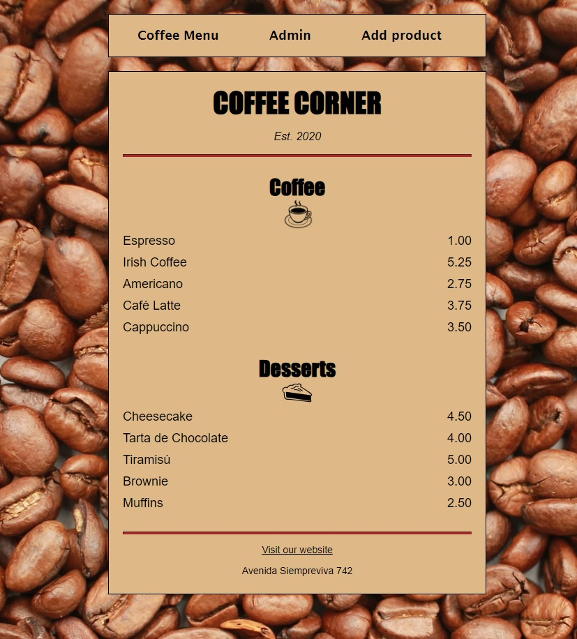
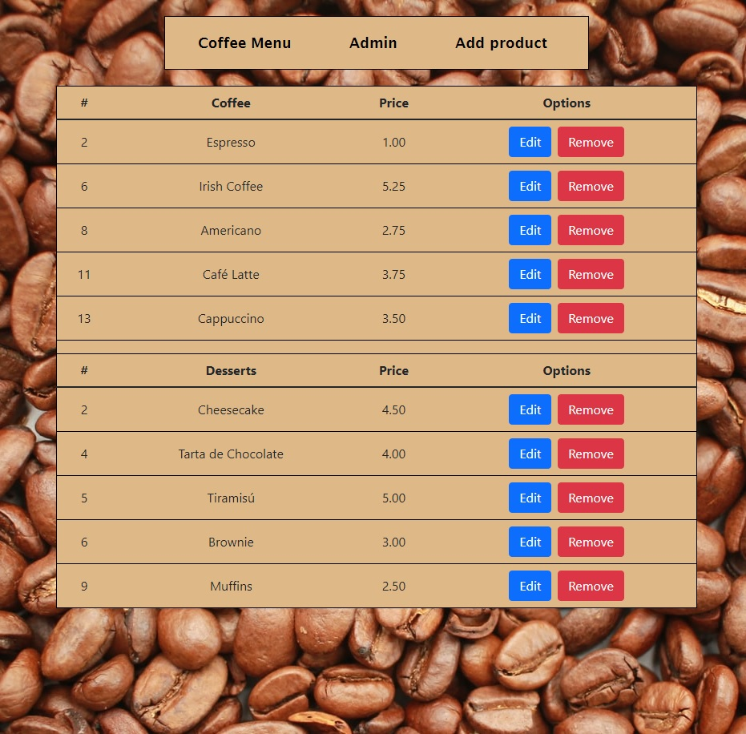
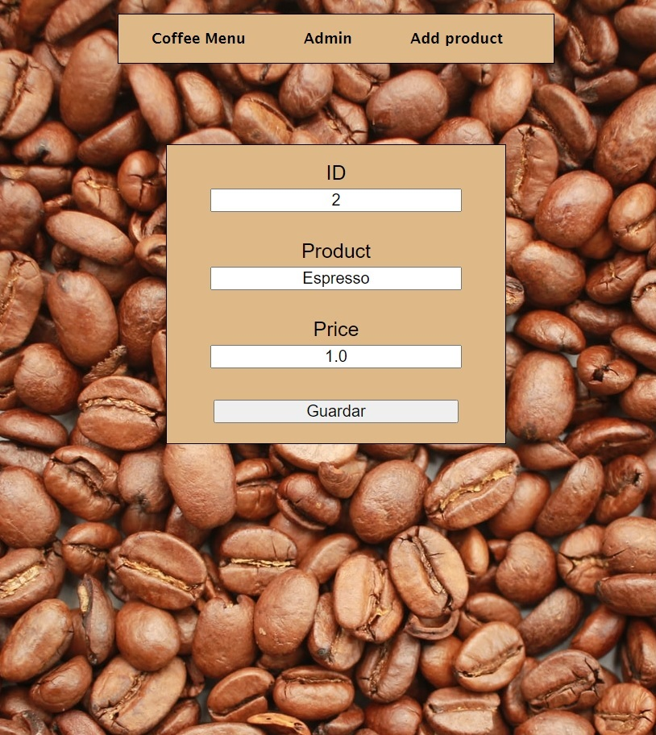
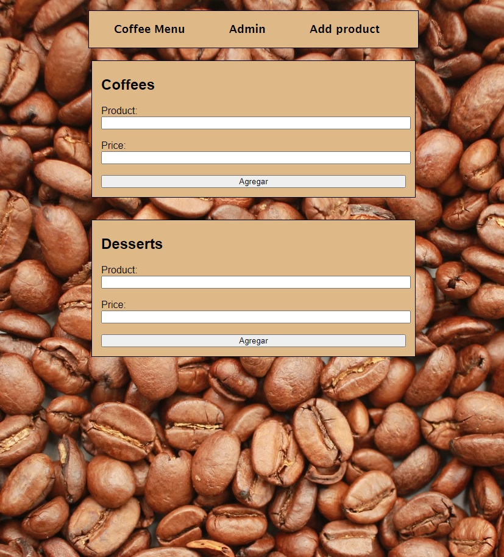

# Coffe Corner

Coffe Corner es un CRUD (Create, Read, Update, Delete) desarrollado con Python, Flask y MySQL, que presenta el menú de un Café a través de una interfaz web sencilla construida con HTML y CSS puro.

## Descripción

El proyecto consiste en un sistema de menú para un Café, donde se muestran productos almacenados en una base de datos MySQL llamada 'menu', con dos tablas: 'café' y 'postres'. La aplicación incluye:

- Una página de inicio (index) que muestra el menú completo.
- Una página de administración para eliminar o editar registros.
- Una página para agregar nuevos productos al menú.

El proyecto está desplegado en PythonAnywhere y es accesible en [https://eze92.pythonanywhere.com/](https://eze92.pythonanywhere.com/) hasta el 09 de octubre de 2024.

## Requisitos del sistema

- Python 3.12.4
- Flask 3.0.3
- Flask-Cors 4.0.1
- Flask-MySQL 1.5.2
- Flask-MySQLdb 2.0.0
- Jinja2 3.1.4
- Werkzeug 3.0.3

## Estructura del Proyecto

- Coffe Corner/
  - static/
    - css/
      - Admin.css
      - Create.css
      - Edit.css
      - Header.css
      - Style.css
    - img/
      - Fondo.jpg
  - templates/
    - coffee/
      - Admin.html
      - Create.html
      - Edit.html
      - Index.html
    - Header.html
  - app.py
  - requirements.txt

## Uso

- Visita la página principal para ver el menú completo.
- Accede a la página de administración para editar o eliminar productos.
- Utiliza la página de creación para añadir nuevos productos al menú.

## Capturas de pantalla

### Página de inicio

*Esta es la página principal donde los usuarios pueden ver el menú completo.*

### Página de administración

*Aquí los administradores pueden editar o eliminar productos del menú.*

### Página de edición

*Aquí se pueden editar el nombre y/o precio del producto del menú.*

### Formulario de creación

*Este formulario permite añadir nuevos productos al menú.*
